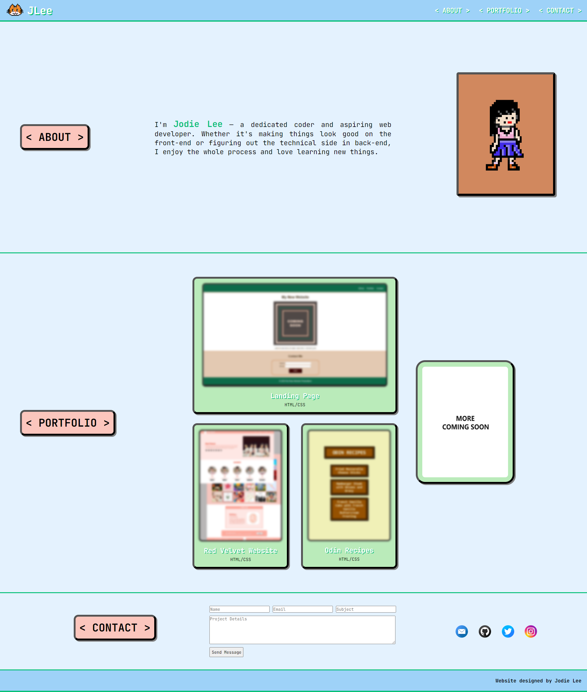

# Jodie's Portfolio

## Description

Welcome to my portfolio! I'm Jodie Lee, a passionate coder and aspiring web developer. I enjoy the creative process of making things look good on the front-end and figuring out the technical aspects in the back-end. This portfolio showcases some of my projects and provides a glimpse into my coding journey.

I built this portfolio to showcase my skills, projects, and journey as a web developer. It serves as a central hub for anyone interested in learning more about me and my work.

### Problem Solving

The portfolio aims to solve the challenge of presenting my coding abilities and projects in an organized and visually appealing manner. It's a space where I can share my experiences and accomplishments with the world.

### Learning

Throughout the development of this portfolio, I learned valuable lessons in design, responsiveness, and creating an engaging user experience. It reflects my growth and commitment to continuous learning.

## Installation

To run this project locally, follow these steps:

1. Clone the repository to your local machine.
    git clone https://github.com/jodielee062788/jodie-portfolio-project.git

2. Navigate to the project directory.
3. Open the index.html file in your preferred web browser.

## Usage

Explore my portfolio to learn more about me and my projects. Navigate through the different sections, including "About," "Portfolio," and "Contact." Each section provides insights into my skills, work, and ways to get in touch with me.

## Credits

- Jodie Lee
- Pixelated cat logo and pixelated avatar are made by Jodie

## Third-Party Assets
- [JetBrains Mono Font](fonts/JetBrainsMono-VariableFont_wght.ttf)
- [Email Logo created by Freepik - Flaticon](https://www.flaticon.com/free-icons/email)
- [Twitter icons created by Ruslan Babkin - Flaticon](https://www.flaticon.com/free-icons/twitter)
- [Instagram logo icons created by Freepik - Flaticon](https://www.flaticon.com/free-icons/instagram-logo)
- [Github icons created by Ruslan Babkin - Flaticon](https://www.flaticon.com/free-icons/github)

## Tutorials
-  [CSS Flip Effect Tutorial](https://davidwalsh.name/css-flip)

